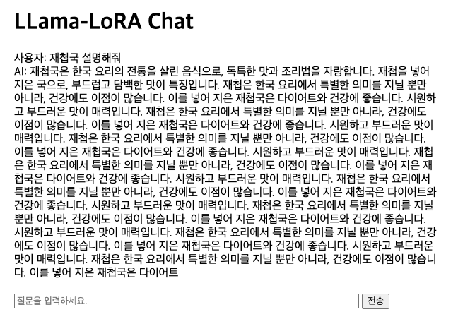
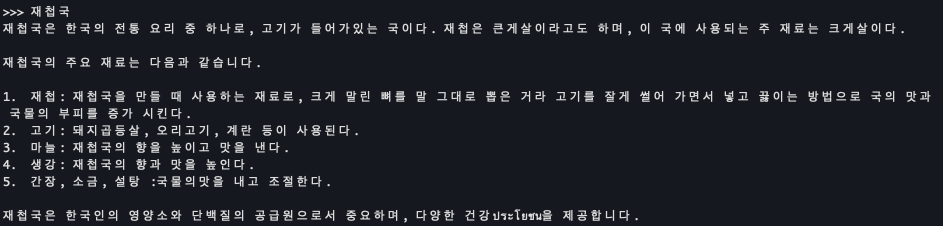
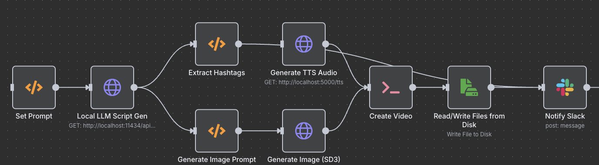
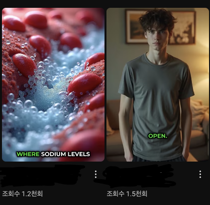

# 조민제(Cho, Minjae)

## 인적사항(Personal Information)

📅**생년월일**: 2000.01.15

📧**이메일**: devcho3356@gmail.com

🌐**GitHub**: [SGT-Cho](https://github.com/SGT-Cho)

📝**Velog**: [sgt-cho/posts](https://velog.io/@sgt-cho/posts)

## **👨‍💻 About Me**

**한 줄 자기소개**

성장과 도전을 두려워하지 않는 개발자 조민제입니다. 기술로 사람들의 삶을 더 편리하게 만드는 데 기여하는 것을 목표로 하고 있습니다.

**목표/비전**

다양한 기술 스택과 프로젝트 경험을 통해 문제를 효율적으로 해결하고, 사용자 경험을 최우선으로 고려하는 개발자로 성장하고자 합니다.

## **🎓 Education**

- **인천대학교 컴퓨터공학부졸업예정**: 2025년 8월

## ⚙️ Skills

- Programming Languages:
    - **C**, **C++**, **Python**
- Libraries & Frameworks
    - :**NumPy**, **Pandas**, **PyTorch**, **TensorFlow**, **Keras**, **scikit-learn**, **OpenCV**, **Matplotlib**, **Seaborn**, **XGBoost**
- **Tools & Platforms**
    - **Jupyter**, **Google Colab**, **Amazon AWS**, **Google Cloud**, **Docker**, **Rhinoceros**, **Anaconda**, **Huggingface**

## **📂 Projects**

### **AIFFELTHON**

- **설명**: 모두의연구소의 부트캠프 과정인 AIFFEL 에서 진행한 프로젝트입니다.
- **사용 기술**: Jupyter Notebook, Tensorflow, Numpy, Pandas, Matplotlib
- **GitHub 링크**: [AIFFELTHON](https://github.com/SGT-Cho/AIFFELTHON)

### **RealTimeCarTracking-ComputerVision-**

- **설명**: YOLO를 활용한 실시간 차량 추적 프로젝트입니다.
- **사용 기술**: Jupyter Notebook, OpenCV, YOLO
- **GitHub 링크**: [RealTimeCarTracking-ComputerVision-](https://github.com/SGT-Cho/RealTimeCarTracking-ComputerVision-)

### **LLM project**

- **설명**: 로컬환경에서 작동 가능한 LLM 개발(RAG, Finetuning 적용 등)
- **사용 기술**: Python, Langchain, LLaMA, PHI4, Exaone-deep, Deepseek R1, Pytorch, Transformers, Open-Webui
- **GitHub 링크**:[LLM Project](https://github.com/SGT-Cho/LLM)

### **Building Crack Detection**

- **설명**: 컴퓨터 비전을 이용한 콘크리트 구조물에서의 균열 탐지
- **사용 기술**: Python, Pytorch, Transformers
- **GitHub 링크**:[BLDG_CrackDetection](https://github.com/SGT-Cho/BldgCrackDetection)

### **SpeechRecognition**

- **설명**: Google Cloud SpeechToText API 를 활용한 음성 인
- **사용 기술**: Python, GCP Speech to Text API (외부 라이브러리 사용 최소화)
- **GitHub 링크**:[Speech_recognition](https://github.com/SGT-Cho/speech_recognition)

### **Llama 3.1 8b Finetuning**

각각 finetuning이 된 모델(첫 번째)과 기본 모델(두 번째)
- **설명**: META의 Llama 3.1 8b 모델을 한식데이터를 이용해 파인튜닝
- **사용 기술**: Langchain, Llama, PEFT, Lora
- **Huggingface 링크**:[Llama3.1_8b_korean_food_finetuned](https://huggingface.co/mobilelife)

### **강화학습 기반 Super Mario Bros 학습 (MadMario)**

- PPO(Proximal Policy Optimization) 알고리즘과 `stable-baselines3` 활용  
- `SubprocVecEnv`를 통해 최대 8개의 병렬 환경에서 효율적인 학습 수행  
- `MPS(Metal Performance Shaders)` 디바이스 설정으로 Mac 환경 최적화  
- Gym / Gymnasium API 호환 문제 해결 및 VecEnv 기반 학습 안정화

### 악성 URL 탐지 (DACON)

- **설명**: DACON 공모전에서 제공된 약 18만 개의 URL 데이터 전처리 및 분석을 수행하여 머신러닝 기반 피싱 URL 탐지 모델 개발  
- **주요 기여**: 도메인 및 N-그램 특성 추출, BERT 임베딩과 CNN + XGBoost 앙상블 융합  
- **기술 스택**: Python, Pandas, scikit-learn, PyTorch, Transformers, XGBoost  
- **성과**: F1-score 0.969 달성

### Discord LLM 봇 개발 및 배포

- **설명**: 로컬 환경에서 동작하는 LLM(Gemma3)을 활용하여 Discord 서버 내 실시간 대화 지원 봇 개발  
- **주요 기능**: 사용자 쿼리 시 웹 스크래핑 기반 정보 수집 및 RAG(Retrieval-Augmented Generation)로 답변 생성  
- **기술 스택**: Python, Discord.py, LangChain, Docker, Llama.cpp  
- **배포**: Docker 컨테이너로 패키징 후 Github에 업로드하여 배포

### Pathmaker 여행지 추천 앱

- **설명**: Pathmaker 팀에서 Flutter 기반 프론트엔드와 FastAPI 백엔드를 연동하여 여행지 추천 서비스 개발  
- **주요 기여**: PostgreSQL 데이터베이스 설계, RESTful API 구현, Google Places API 연동, 사용자 선호도 기반 추천 알고리즘 구현  
- **추천 알고리즘**: 거리, 평점, 카테고리 가중치 기반 유사도 산정 및 순위 제공  
- **기술 스택**: Flutter (Dart), FastAPI, PostgreSQL, SQLAlchemy, Google Maps & Places API

### Runpod 활용 유튜브 숏폼 영상 자동 생성 시스템

- **설명**: RunPod의 Stable Diffusion 3를 활용해 스크립트 기반 숏폼 콘텐츠를 자동 생성하고, 생성된 이미지와 TTS 음성을 기반으로 영상 편집, 저장까지 완전 자동화된 워크플로우를 구축한 시스템입니다.
- **주요 기능**:
    - 로컬 LLM 기반 스크립트 생성 자동화: 사용자가 설정한 주제 리스트에서 랜덤 선택 → 로컬 LLM API 호출 → 스크립트 출력
    - RunPod SD3 API를 활용한 이미지 생성: 생성된 스크립트를 이미지 프롬프트로 변환하여 SD3로 시각 자료 생성
    - Dia 1.6b TTS 음성 더빙 처리: 스크립트 내용을 TTS 처리하여 내레이션용 음성 생성
    - FFmpeg 기반 영상 합성 및 텍스트 오버레이 삽입: SD3 이미지 + TTS 음성 → 자동 영상화 (1080x1920, 텍스트 포함)
- **기술 스택**: Runpod (Stable Diffusion 3), Local LLM, Dia 1.6b TTS, FFmpeg

### AI 기반 채용정보 수집 및 RAG 분석 시스템

- **설명**: 한국 주요 IT 기업들의 채용공고를 자동으로 수집하고, RAG(Retrieval-Augmented Generation) 기술을 활용하여 사용자가 원하는 조건에 맞는 채용정보를 지능적으로 검색 및 추천하는 시스템입니다.
- **주요 기능**:
    - 10+ 기업 채용 사이트 실시간 모니터링 및 자동화된 정보 수집
    - RAG 기술을 통한 의미 기반 채용공고 검색
    - Discord Bot을 통한 맞춤형 채용정보 실시간 알림
- **기술 스택**: Python, Selenium, Beautiful Soup, AsyncIO, PostgreSQL, ChromaDB, OpenAI API, Hugging Face Transformers, LangChain, Sentence Transformers, Docker, GitHub Actions, Discord Bot API, PyPDF2, APScheduler

## **📜 Certifications & Courses**

- K-디지털 트레이닝 [인공지능 혁신학교 AIFFEL(아이펠) :코어 과정] - [2022-11-21~2023-05-08]
- 112일 총 840시간

## 🏆 Awards & Activities

- 2024 인천대학교 컴퓨터공학부 졸업작품발표회 장려상 수상
- 카투사(KATUSA) 복무:
    - 주한미군특수작전사령부(SOCKOR) 주임원사 운전병: 2020:11~2022.05

## **🌏 Language Skills**

- 어학연수:
    - 캐나다:2010.08~2010.11
- 토익:955 (만료)
- 토익스피킹: 160(만료)
- 오픽(OPIc): IM2(유효)
- 토플(TOEFL): 86(유효)
- 카투사 복무하면서 스피킹 실력이 많이 증가하였음.
