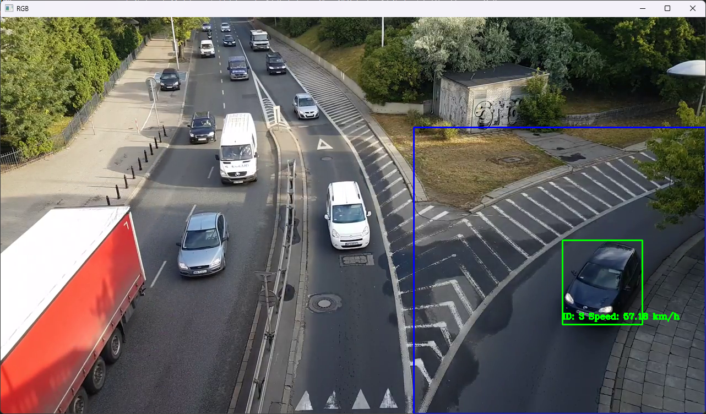

# 조민제(Cho, Minjae)

## 인적사항(Personal Information)

📅**생년월일**: 2000.01.15

📧**이메일**: devcho3356@gmail.com

🌐**GitHub**: [SGT-Cho](https://github.com/SGT-Cho)

📝**Velog**: [sgt-cho/posts](https://velog.io/@sgt-cho/posts)

## **👨‍💻 About Me**

**한 줄 자기소개**

성장과 도전을 두려워하지 않는 개발자 조민제입니다. 기술로 사람들의 삶을 더 편리하게 만드는 데 기여하는 것을 목표로 하고 있습니다.

**목표/비전**

다양한 기술 스택과 프로젝트 경험을 통해 문제를 효율적으로 해결하고, 사용자 경험을 최우선으로 고려하는 개발자로 성장하고자 합니다.

## **🎓 Education**

- **인천대학교 컴퓨터공학부졸업예정**: 2024년 8월

## ⚙️ Skills

- Programming Languages:
    - **C**, **C++**, **Python**
- Libraries & Frameworks
    - :**NumPy**, **Pandas**, **PyTorch**, **TensorFlow**, **Keras**, **scikit-learn**, **OpenCV**, **Matplotlib**, **Seaborn**, **XGBoost**
- **Tools & Platforms**
    - **Jupyter**, **Google Colab**, **Amazon AWS**, **Google Cloud**, **Docker**, **Rhinoceros**, **Anaconda**

## **📂 Projects**

### **AIFFELTHON**

- **설명**: 모두의연구소의 부트캠프 과정인 AIFFEL 에서 진행한 프로젝트입니다.
- **사용 기술**: Jupyter Notebook, Tensorflow, Numpy, Pandas, Matplotlib
- **GitHub 링크**: [AIFFELTHON](https://github.com/SGT-Cho/AIFFELTHON)

### **RealTimeCarTracking-ComputerVision-**

- **설명**: YOLO를 활용한 실시간 차량 추적 프로젝트입니다.
- **사용 기술**: Jupyter Notebook, OpenCV, YOLO
- **GitHub 링크**: [RealTimeCarTracking-ComputerVision-](https://github.com/SGT-Cho/RealTimeCarTracking-ComputerVision-)

### **LLM project**

- **설명**: 로컬환경에서 작동 가능한 LLM 개발(RAG, Finetuning 적용 등)
- **사용 기술**: Python, Langchain, LLaMA, PHI4, Deepseek R1, Pytorch, Transformers
- **GitHub 링크**:[LLM Project](https://github.com/SGT-Cho/LLM)

### **Building Crack Detection**

- **설명**: 컴퓨터 비전을 이용한 콘크리트 구조물에서의 균열 탐지
- **사용 기술**: Python, Pytorch, Transformers
- **GitHub 링크**:[BLDG_CrackDetection](https://github.com/SGT-Cho/BldgCrackDetection)

### **SpeechRecognition**

- **설명**: Google Cloud SpeechToText API 를 활용한 음성 인
- **사용 기술**: Python, GCP Speech to Text API (외부 라이브러리 사용 최소화)
- **GitHub 링크**:[Speech_recognition](https://github.com/SGT-Cho/speech_recognition)

### **Llama 3.1 8b Finetuning**

- **설명**: META의 Llama 3.1 8b 모델을 한식데이터를 이용해 파인튜닝
- **사용 기술**: Langchain, Llama, PEFT, Lora
- **Huggingface 링크**:[Llama3.1_8b_korean_food_finetuned](https://huggingface.co/mobilelife)

## **📜 Certifications & Courses**

- K-디지털 트레이닝 [인공지능 혁신학교 AIFFEL(아이펠) :코어 과정] - [2022-11-21~2023-05-08]
- 112일 총 840시간

## 🏆 Awards & Activities

- 2024 인천대학교 컴퓨터공학부 졸업작품발표회 장려상 수상
- 카투사(KATUSA) 복무:
    - 주한미군특수작전사령부(SOCKOR) 주임원사 운전병: 2020:11~2022.05

## **🌏 Language Skills**

- 어학연수:
    - 캐나다:2010.08~2010.11
- 토익:955 (만료)
- 토익스피킹: 160(만료)
- 오픽(OPIc): IM2(유효)
- 카투사 복무하면서 스피킹 실력이 많이 증가하였음.
