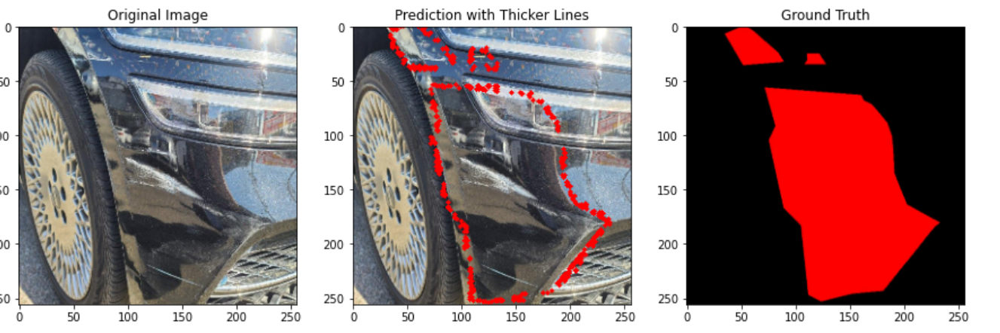
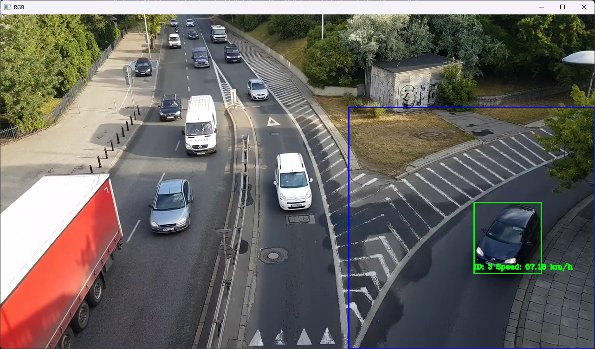
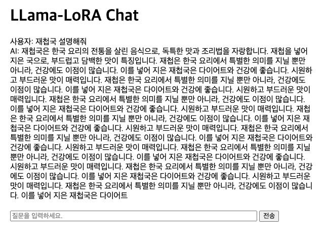
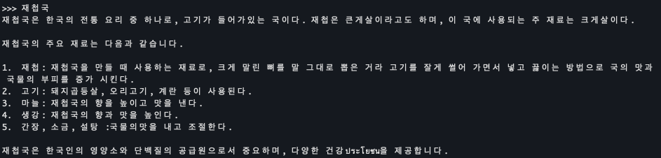
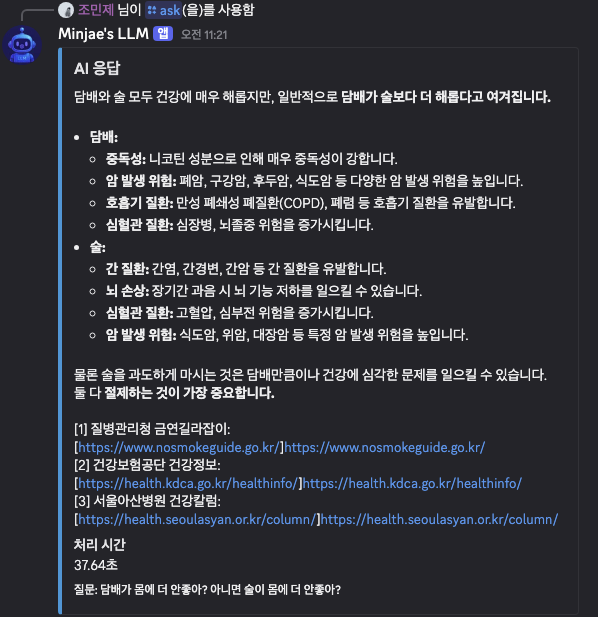
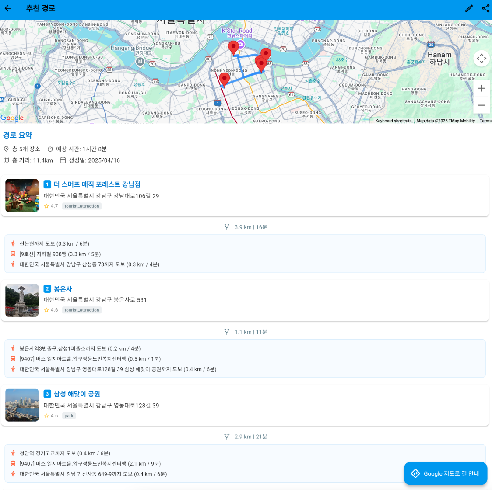
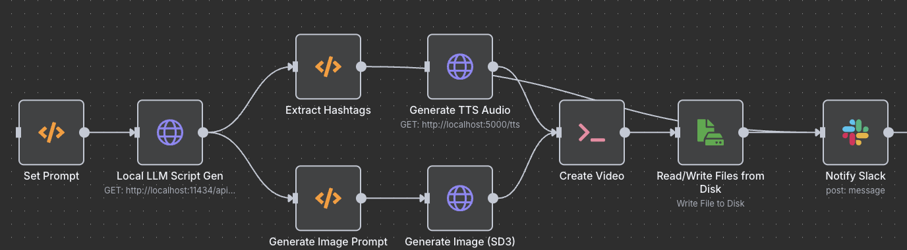
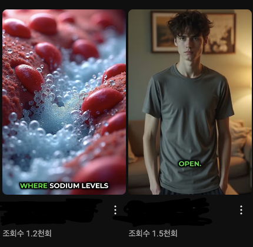
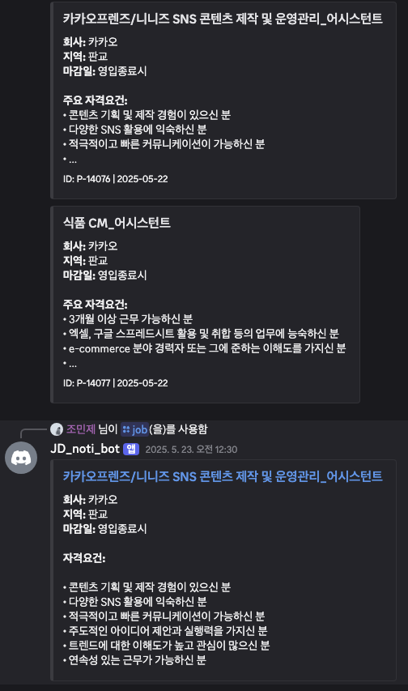

# Minjae Cho

## Personal Information

📅 **Date of Birth**: January 15, 2000

📧 **Email**: devcho3356@gmail.com

🌐 **GitHub**: [SGT-Cho](https://github.com/SGT-Cho)

📝 **Velog**: [sgt-cho/posts](https://velog.io/@sgt-cho/posts)

## 👨‍💻 About Me

**One-line Introduction**

I'm Minjae Cho, a developer who embraces growth and challenges. My goal is to use technology to make people's lives more convenient.

**Goals/Vision**

I strive to become a developer who solves problems efficiently through diverse tech stacks and project experiences, always prioritizing user experience.

## 🎓 Education

- **Incheon National University**, Bachelor of Computer Science, Expected Graduation: August 2024

## ⚙️ Skills

- **Programming Languages**:
    - **C**, **C++**, **Python**
- **Libraries & Frameworks**:
    - **NumPy**, **Pandas**, **PyTorch**, **TensorFlow**, **Keras**, **scikit-learn**, **OpenCV**, **Matplotlib**, **Seaborn**, **XGBoost**
- **Tools & Platforms**:
    - **Jupyter**, **Google Colab**, **Amazon AWS**, **Google Cloud**, **Docker**, **Rhinoceros**, **Anaconda**, **Huggingface**

## 📂 Projects

### AIFFELTHON

- **Description**: A project conducted during AIFFEL, a bootcamp by "modulabs".
- **Tech Stack**: Jupyter Notebook, TensorFlow, NumPy, Pandas, Matplotlib
- **GitHub Link**: [AIFFELTHON](https://github.com/SGT-Cho/AIFFELTHON)

### RealTimeCarTracking-ComputerVision-

- **Description**: Real-time vehicle tracking using YOLO.
- **Tech Stack**: Jupyter Notebook, OpenCV, YOLO
- **GitHub Link**: [RealTimeCarTracking-ComputerVision-](https://github.com/SGT-Cho/RealTimeCarTracking-ComputerVision-)

### LLM project

- **Description**: Developed an LLM that can operate in local environments (including RAG and Finetuning).
- **Tech Stack**: Python, Langchain, LLaMA, PHI4, Deepseek R1, PyTorch, Transformers
- **GitHub Link**: [LLM Project](https://github.com/SGT-Cho/LLM)

### Building Crack Detection

- **Description**: Crack detection in concrete structures using computer vision.
- **Tech Stack**: Python, PyTorch, Transformers
- **GitHub Link**: [BLDG_CrackDetection](https://github.com/SGT-Cho/BldgCrackDetection)

### Speech Recognition

- **Description**: Speech recognition using Google Cloud's Speech-to-Text API.
- **Tech Stack**: Python, GCP Speech-to-Text API (minimal external libraries)
- **GitHub Link**: [Speech_recognition](https://github.com/SGT-Cho/speech_recognition)

### Llama 3.1 8b Finetuning

(First image: Finetuned model, Second image: Base model)

- **Description**: Finetuned META's Llama 3.1 8b model using Korean cuisine datasets.
- **Tech Stack**: Langchain, Llama, PEFT, Lora
- **Huggingface Link**: [Llama3.1_8b_korean_food_finetuned](https://huggingface.co/mobilelife)

### Reinforcement Learning–based Super Mario Bros Training (MadMario)
  
- **Description**: Trained an agent to play Super Mario Bros using PPO and parallel environments.  
- **Key Details**:  
  - Used `stable-baselines3` PPO with up to 8 parallel `SubprocVecEnv` instances  
  - Optimized for Mac MPS (Metal Performance Shaders)  
  - Resolved Gym/Gymnasium API compatibility for stable VecEnv training  
- **Tech Stack**: Python, Stable-Baselines3, Gymnasium, PyTorch

### Malicious URL Detection (DACON)
- **Description**: Developed a phishing URL detection model for the DACON competition by preprocessing and analyzing ~180,000 URLs.  
- **Key Contributions**: Engineered domain-based and character n-gram features; fused BERT embeddings with a CNN + XGBoost ensemble.  
- **Tech Stack**: Python, Pandas, scikit-learn, PyTorch, Transformers, XGBoost  
- **Achievement**: Achieved an F1-score of 0.969

### Discord LLM Bot Development & Deployment
  
- **Description**: Built a Discord chat-assistant bot powered by a local LLM (Gemma3).  
- **Key Features**: Performs web scraping on user queries and uses RAG (Retrieval-Augmented Generation) for informed responses.  
- **Tech Stack**: Python, discord.py, LangChain, Docker, Llama.cpp  
- **Deployment**: Packaged as a Docker container and hosted on GitHub for continuous availability

### Pathmaker Destination Recommendation App
  
- **Description**: Travel destination recommendation service combining Flutter frontend and FastAPI backend.  
- **Key Contributions**: Designed PostgreSQL schema; implemented RESTful APIs; integrated Google Places API; developed user-preference recommendation algorithm.  
- **Recommendation Algorithm**: Computes weighted similarity scores based on distance, ratings, and category weight.  
- **Tech Stack**: Flutter (Dart), FastAPI, PostgreSQL, SQLAlchemy, Google Maps & Places API

### Automated YouTube Shorts Generation using Runpod

  

- **Description**: Developed a fully automated workflow system that generates short-form video content based on scripts using RunPod's Stable Diffusion 3. The system handles everything from image generation and TTS voice-over to video editing and saving.
- **Key Features**:
    - Automated script generation via Local LLM: Randomly selects a topic from a user-defined list → Calls Local LLM API → Outputs script.
    - Image generation using RunPod SD3 API: Converts the generated script into image prompts to create visuals with SD3.
    - Dia 1.6b TTS for voice-over: Processes the script content with TTS to create narration audio.
    - Video synthesis and text overlay with FFmpeg: Combines SD3 images + TTS audio → Automated video creation (1080x1920, including text).
- **Tech Stack**: Runpod (Stable Diffusion 3), Local LLM, Dia 1.6b TTS, FFmpeg

### AI-Powered Job Posting Collection & RAG Analysis System
  

- **Description**: An intelligent system that automatically collects job postings from major Korean IT companies and utilizes RAG (Retrieval-Augmented Generation) technology to intelligently search and recommend job information tailored to user-defined criteria.
- **Key Features**:
    - Real-time monitoring and automated information gathering from 10+ company career sites.
    - Semantic-based job posting search leveraging RAG technology.
    - Personalized real-time job alerts delivered via a Discord Bot.
- **Tech Stack**: Python, Selenium, Beautiful Soup, AsyncIO, PostgreSQL, ChromaDB, OpenAI API, Hugging Face Transformers, LangChain, Sentence Transformers, Docker, GitHub Actions, Discord Bot API, PyPDF2, APScheduler

## 📜 Certifications & Courses

- K-Digital Training [AI Innovation School "AIFFEL": Core Course] - [2022-11-21~2023-05-08]
- Total: 112 days (840 hours)

## 🏆 Awards & Activities

- Encouragement Award, Incheon National University Computer Science Graduation Project Presentation (2024)
- Served in KATUSA (Korean Augmentation to the U.S. Army):
    - Driver for Command Sergeant Major, Special Operations Command Korea (SOCKOR), Nov 2020 - May 2022

## 🌏 Language Skills

- Language Training: Canada (Aug 2010 – Nov 2010)  
- TOEIC: 955 (expired)  
- TOEIC Speaking: 160 (expired)  
- OPIc: IM2 (valid)  
- TOEFL: 86 (valid)  
- Significantly improved speaking skills during KATUSA service.

