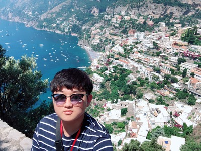

# Minjae Cho

## Personal Information

📅 **Date of Birth**: January 15, 2000

📧 **Email**: devcho3356@gmail.com

🌐 **GitHub**: [SGT-Cho](https://github.com/SGT-Cho)

📝 **Velog**: [sgt-cho/posts](https://velog.io/@sgt-cho/posts)

## 👨‍💻 About Me

**One-line Introduction**

I'm Minjae Cho, a developer who embraces growth and challenges. My goal is to use technology to make people's lives more convenient.

**Goals/Vision**

I strive to become a developer who solves problems efficiently through diverse tech stacks and project experiences, always prioritizing user experience.

## 🎓 Education

- **Incheon National University**, Bachelor of Computer Science, Expected Graduation: August 2024

## ⚙️ Skills

- **Programming Languages**:
    - **C**, **C++**, **Python**
- **Libraries & Frameworks**:
    - **NumPy**, **Pandas**, **PyTorch**, **TensorFlow**, **Keras**, **scikit-learn**, **OpenCV**, **Matplotlib**, **Seaborn**, **XGBoost**
- **Tools & Platforms**:
    - **Jupyter**, **Google Colab**, **Amazon AWS**, **Google Cloud**, **Docker**, **Rhinoceros**, **Anaconda**, **Huggingface**

## 📂 Projects

### AIFFELTHON

- **Description**: A project conducted during AIFFEL, a bootcamp by "modulabs".
- **Tech Stack**: Jupyter Notebook, TensorFlow, NumPy, Pandas, Matplotlib
- **GitHub Link**: [AIFFELTHON](https://github.com/SGT-Cho/AIFFELTHON)

### RealTimeCarTracking-ComputerVision-

- **Description**: Real-time vehicle tracking using YOLO.
- **Tech Stack**: Jupyter Notebook, OpenCV, YOLO
- **GitHub Link**: [RealTimeCarTracking-ComputerVision-](https://github.com/SGT-Cho/RealTimeCarTracking-ComputerVision-)

### LLM project

- **Description**: Developed an LLM that can operate in local environments (including RAG and Finetuning).
- **Tech Stack**: Python, Langchain, LLaMA, PHI4, Deepseek R1, PyTorch, Transformers
- **GitHub Link**: [LLM Project](https://github.com/SGT-Cho/LLM)

### Building Crack Detection

- **Description**: Crack detection in concrete structures using computer vision.
- **Tech Stack**: Python, PyTorch, Transformers
- **GitHub Link**: [BLDG_CrackDetection](https://github.com/SGT-Cho/BldgCrackDetection)

### Speech Recognition

- **Description**: Speech recognition using Google Cloud's Speech-to-Text API.
- **Tech Stack**: Python, GCP Speech-to-Text API (minimal external libraries)
- **GitHub Link**: [Speech_recognition](https://github.com/SGT-Cho/speech_recognition)

### Llama 3.1 8b Finetuning

(First image: Finetuned model, Second image: Base model)

- **Description**: Finetuned META's Llama 3.1 8b model using Korean cuisine datasets.
- **Tech Stack**: Langchain, Llama, PEFT, Lora
- **Huggingface Link**: [Llama3.1_8b_korean_food_finetuned](https://huggingface.co/mobilelife)

⸻

Reinforcement Learning-based Super Mario Bros Training (MadMario)
- Implemented Proximal Policy Optimization (PPO) using the stable-baselines3 library
- Utilized SubprocVecEnv to enable efficient training across up to 8 parallel environments
- Optimized for macOS by configuring MPS (Metal Performance Shaders) as the training device
- Resolved compatibility issues between Gym and Gymnasium APIs, ensuring stable training with VecEnv

⸻

## 📜 Certifications & Courses

- K-Digital Training [AI Innovation School "AIFFEL": Core Course] - [2022-11-21~2023-05-08]
- Total: 112 days (840 hours)

## 🏆 Awards & Activities

- Encouragement Award, Incheon National University Computer Science Graduation Project Presentation (2024)
- Served in KATUSA (Korean Augmentation to the U.S. Army):
    - Driver for Command Sergeant Major, Special Operations Command Korea (SOCKOR), Nov 2020 - May 2022

## 🌏 Language Skills

- Language Training:
    - Canada: Aug 2010 - Nov 2010
- TOEIC: 955 (expired)
- TOEIC Speaking: 160 (expired)
- OPIc: IM2 (valid)
- Enhanced speaking skills significantly during KATUSA service.

